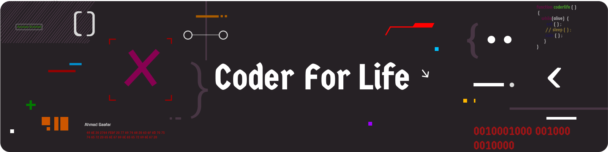

# 👋 Hi! I'm Adham, a Full-Stack Developer  
* 🧠 Building playful AI tools & websites    
* 👨🏼‍🎓 Aspiring CS + AI student    
* 👨🏼‍💻 Full-Stack Developer since 2020    
* 🎯 Turning ideas into real-world projects  

# 💻 Tech Stack:
                      

<picture>
  <source media="(prefers-color-scheme: dark)" srcset="https://raw.githubusercontent.com/tobiasmeyhoefer/tobiasmeyhoefer/output/github-snake-dark.svg" />
  <source media="(prefers-color-scheme: light)" srcset="https://raw.githubusercontent.com/tobiasmeyhoefer/tobiasmeyhoefer/output/github-snake.svg" />
  
</picture>
